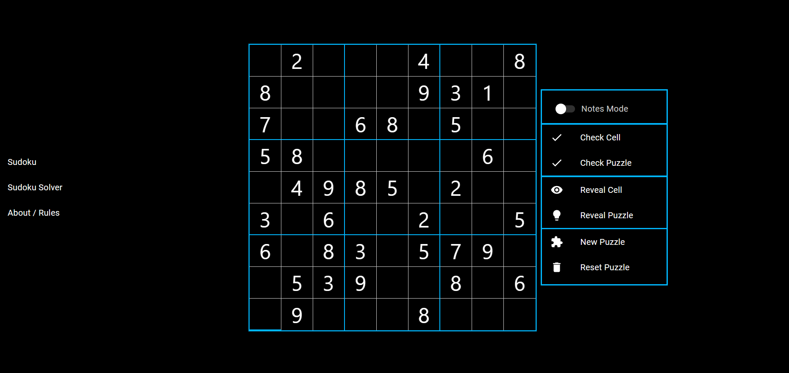
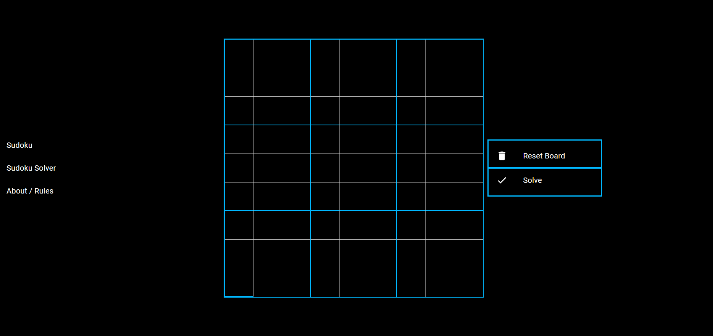

# Sudoku Game/Solver
🌐 [Visit the Live Website!](https://master.di6ym6l9re7e7.amplifyapp.com)
## ✨ Features
- Play Page: Access up to 9,000 unique 9x9 Sudoku puzzles with tools for cell checking, note-taking, and solution reveals.
- Solver Page: Input any 9x9 puzzle to receive an instant solution, using backend algorithms to solve the puzzle.
- About Page: Provides Sudoku rules, gameplay tips, and an "About Me" section to learn more about the developer.
# 🚀 Getting Started
## Prerequisites
- Java and Maven for backend setup
- Node.js and npm for frontend setup
## Installation
1. Clone the repository:
```
git clone https://github.com/yourusername/sudoku-solver
cd sudoku-solver
```
2. Backend Setup:
   - Navigate to the backend directory:
`cd backend`
    - Run the application:
`mvn spring-boot:run`
3. Frontend Setup:
    - Navigate to the frontend directory `cd ../frontend`
    - Install dependencies and start the app:
```
npm install
npm start
```
## 📷 Screenshots

___

## 🤝 Contributing
Contributions are welcome! Please fork this repository, make a new branch, and submit a pull request. For major changes, consider opening an issue to discuss your ideas.

